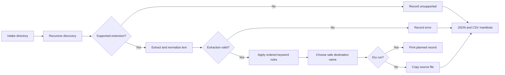

# Document Workflow Automation

A practical Python CLI that turns a mixed document intake folder into a predictable, auditable category structure. It recursively discovers files, extracts normalized text from supported formats, applies ordered keyword rules, copies source files safely, and produces JSON and CSV manifests.

The project uses only the Python standard library at runtime and in tests.

## What it does

- Recursively scans `.txt`, `.md`, `.csv`, and `.json` files
- Normalizes whitespace before classification
- Applies category rules in their JSON order, with a required fallback
- Preserves every source file and copies metadata where the platform supports it
- Resolves same-name collisions deterministically with numeric suffixes such as `report-2.txt`
- Records unsupported files and per-file processing errors without stopping the batch
- Writes `manifest.json` and `manifest.csv`
- Offers a dry run that writes nothing and prints the planned records
- Rejects category names that could escape the output directory
- Rejects symbolic-link sources to prevent copying files from outside the intake directory
- Uses clear process exit codes for automation

## Workflow



## Repository layout

```text
.
├── samples/
│   ├── input/
│   └── rules.json
├── src/document_workflow/
│   ├── __init__.py
│   ├── __main__.py
│   ├── cli.py
│   ├── core.py
│   └── workflow.py
├── tests/
├── LICENSE
├── README.md
└── pyproject.toml
```

## Quickstart

Python 3.11 or newer is required.

Run directly from the repository without installing anything:

```bash
PYTHONPATH=src python3 -m document_workflow.cli samples/input \
  --output demo-output \
  --rules samples/rules.json
```

Preview the work without creating the output directory:

```bash
PYTHONPATH=src python3 -m document_workflow.cli samples/input \
  --output demo-output \
  --rules samples/rules.json \
  --dry-run
```

Run the tests:

```bash
python3 -m unittest discover -s tests -v
```

An optional local install exposes the `document-workflow` command:

```bash
python3 -m pip install .
document-workflow samples/input --output demo-output --rules samples/rules.json
```

## Rule format

Rules are checked before scanning begins. Categories are evaluated from top to bottom. The first category with any matching keyword wins.

```json
{
  "fallback": "other",
  "categories": [
    {"name": "finance", "keywords": ["invoice", "payment"]},
    {"name": "legal", "keywords": ["contract", "agreement"]}
  ]
}
```

Category and fallback names must be single safe folder names. Absolute paths, separators, `.` and `..` are rejected.

## Verified demo

Running the quickstart command against the included sample input produced:

```text
summary: copied=4 skipped=1 errors=0

demo-output/finance/invoice.txt
demo-output/legal/contract.md
demo-output/other/project.json
demo-output/people/applicants.csv
demo-output/manifest.json
demo-output/manifest.csv
```

The included `scan.pdf` is recorded as unsupported and is not copied. Each manifest record includes the relative source path, category, destination, status, and message.

## Exit codes

| Code | Meaning |
| ---: | --- |
| `0` | Run completed without document processing errors |
| `1` | Run completed, but one or more supported documents could not be processed |
| `2` | The command, input path, output path, or rules configuration is invalid |

Unsupported file extensions are expected skips and do not cause a nonzero exit code.

## Safety and privacy

Processing is local. The tool makes no network calls, stores no credentials, and does not send document content to external services. Sources are read only. Normal runs create copies beneath the chosen output directory. Dry runs do not create files or directories.

Keep sensitive manifests protected because source names, destination names, categories, and error messages may reveal business context. Review keyword rules and output access permissions before using real documents.

## Limitations

- PDF and DOCX extraction are not implemented.
- Input text must use UTF-8 encoding.
- Classification is deterministic keyword matching, not semantic or machine learning classification.
- Matching is case insensitive substring matching. Rule order resolves documents that match multiple categories.
- The CLI requires the output directory to be outside the scanned input directory.
- Existing destination names cause the next available numeric suffix to be selected.

## Development method

Features were built with `unittest` using test-first RED, GREEN, and refactor cycles. Actual command output from those cycles is preserved in [`docs/tdd-evidence.md`](docs/tdd-evidence.md).

## License

MIT
